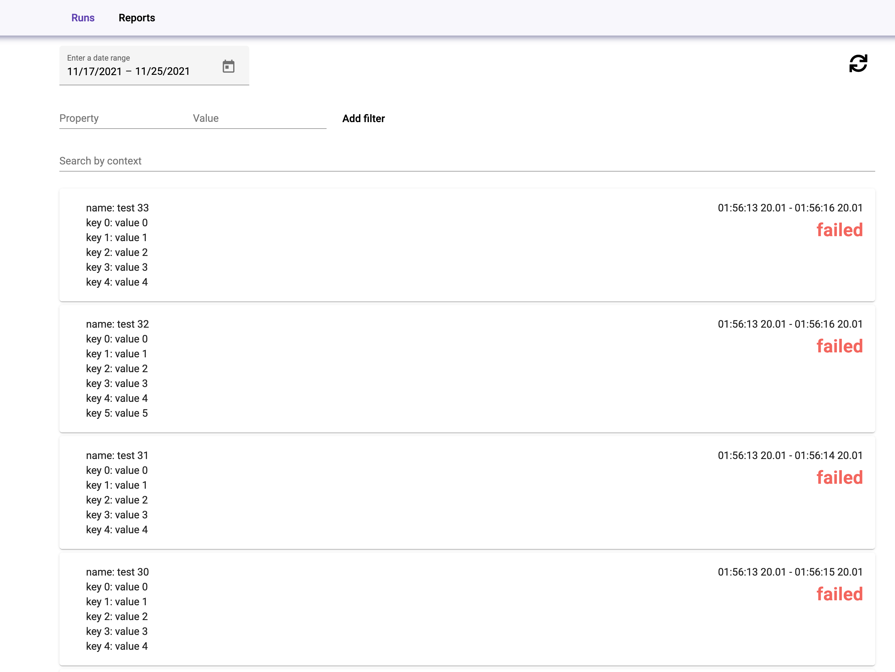

# Stress report framework

Report framework for stress testing  
Developed for https://github.com/pilshchikov/test_framework

Components:
 - Frontend - React ([Material UI](https://next.material-ui.com/), [Apache ECharts](https://echarts.apache.org/)) - [here](./frontend)
 - Server - Python 3.9 ([AIOHTTP](https://docs.aiohttp.org), [AsyncPG](https://github.com/MagicStack/asyncpg)) - [here](./backend/server)
 - Files - GO ([ulikunitz/xz](https://github.com/ulikunitz/xz), [pq](https://github.com/lib/pq)) - [here](./backend/files)
 - DB - [YugabyteDB](https://www.yugabyte.com/)

### Architecture:


### Requirements
- Python 3.9+
- golang 1.16+
- npm
- Docker
- (optional) Terraform

### How to run:
1. Point env data params
```shell
export FILES_DIR=/your/local/files/dir/path
export DB_PATH=/your/local/db/dir/path
```
2. Start
```shell
# with docker-compose
docker-compose up [-d]
# or with docker swarm
docker swarm init
docker stack deploy -c docker-compose.yaml stress-report
```

### Run VM in AWS cloud
1. Install terraform
2. Go to script directory: `cd scripts/env/aws`
3. Prepare terraform: `terraform init`
4. Create `keys.tfvar` file with keys all properties for instances somewhere in private directory:
```shell
aws_access_key="[your aws access key]"
aws_secret_key="[your aws secret key]"

ssh_key_name="[existed key with whom you will be connecting to instances].pem"
subnet_id="[private subnet id]"
vpc_id="[your custom vpc od]"
tag_name="[your user name for instances identification]"
private_key="[absolute path to your local private key pointed in ssh_key_name]"
```
5. Start infrastructure `terraform apply -var-file=/path/to/your/keys.tfvar`
6. `terraform apply` returned `report_service_ip` value, use it to ssh on VM and run it with docker-compose
```shell
ssh -i /your/key/path.pem ec2-user@[vm ip]
cd /home/ec2-user
docker-compose up -d
```
8. Destroy infrastructure after all `terraform destroy -var-file=/path/to/your/keys.tfvar`


##### Tests list


##### Test details

